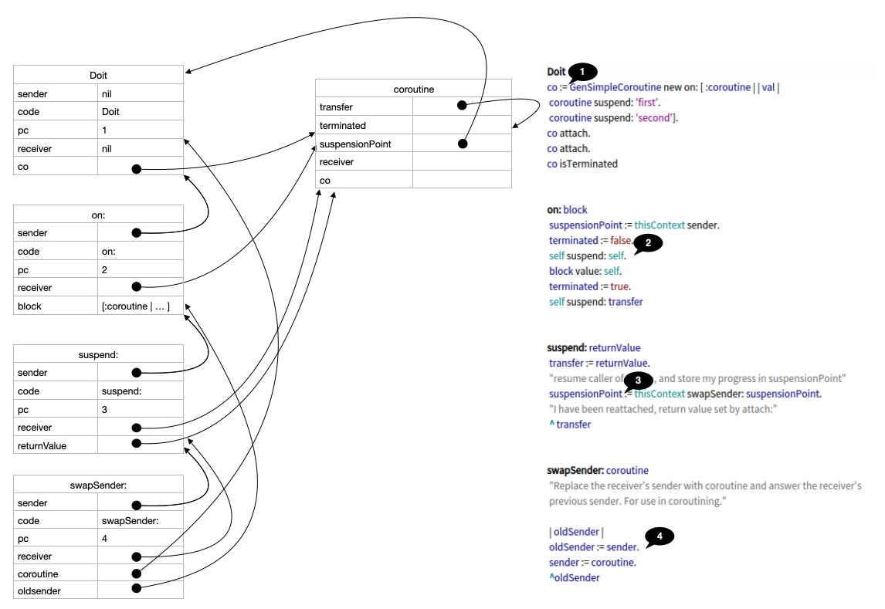
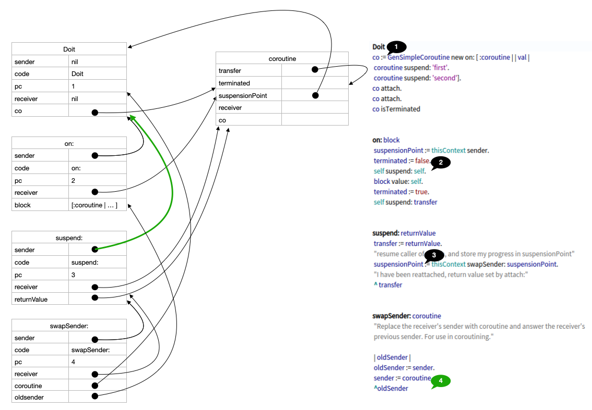
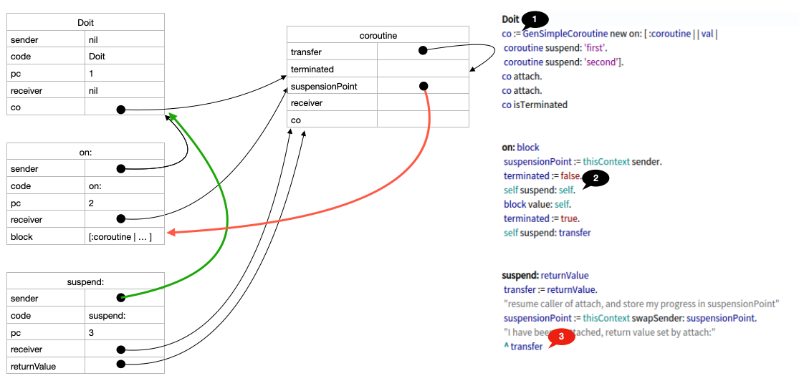
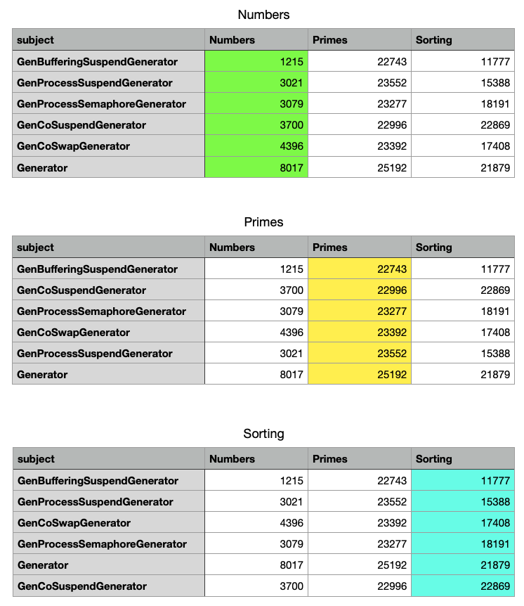

# Generator performance
Pharo has a class `Generator`, which is implemented using `Context>>#swapSender:`.

The goal of note is to document the relative performance of a number of differnet ways to implement Generators. A total of 6 generator implementations will be examined:

- The Pharo generator
- `GenProcessSuspendGenerator` A generator based on processes synchronized using suspend/resume
- `GenProcessSemaphoreGenerator` A generator based on processes synchronized using semaphores
- Two generators based on top of two different coroutine implementations
  - `GenCoSwapGenerator` A coroutine implemented using `Context>>#swapSender:` 
  - `GenCoSuspendGenerator` A coroutine implemented using a pharo process and controlled using process suspend/resume
- `GenBufferingSuspendGenerator` A buffering generator

All generators satisfy the tests of the Pharo generator, including error progression, termination and restarting.

## What is a generator
One way to understand a generator is as a read-stream where the elements in the stream are computed (as opposed to read from a file).  In code it looks like this:
```
gen := Generator on: [ :g | g yield: 99. g yield: 111 ].
{gen next. gen atEnd}. "#(99 false)"
{gen next. gen atEnd}. "#(111 true)"
{gen next. gen atEnd}. "#(nil true)"
```
The first line builds a generator from a block. The block is given a generator instance. Elements in the stream are given by `yield:`.
The generator `gen` satisfy the same interface as streams. The three lines show that the first element is 99, and the generator is not at its end. Next element is 111, and that was the end of the generator. Last, generators do not fail if read past end, but produce an endless series of `nil`.

When the generator is buildt, its first element is computed (or the generator is marked as ended). When next is called, that element is returned, and the second element is computed (or the generator is marked as ended). And so on.

The next element can be read by `Generator>>#peek`.  As next, peek returns nil when the generator is at its end.

All generators discussed in this note are subclasses of stream. In particular they implement `Stream>>#contents`, which returns an array of all (remaining) elements of the stream.

# Implementations
The discussion of the implementations below does not account for error propagation, premature closure or restarting.

## GenProcessSuspendGenerator
The easist implementation to understand is perhaps `GenProcessSuspendGenerator`.  Its principle can be shown using this sequence diagram illustrating the code:
```
gen := Generator on: [ :g | "generator computing" g yield: 17. "generator computing" g yield: 19 ].
"client doing stuff"
gen next.
"client doing stuff"
gen next.
```

$$plantuml
@startuml
hide footbox
participant "client" as CL <<Process>> 
participant generator as G
participant "genProcess" as GP <<Process>>

CL -> G : on: aBlock 
activate G
G -> GP : fork
G -->o CL : suspend
... Generator computing ...
GP -> G : yield: 17
activate G
rnote over G : nextVal is 17
G -->o CL : resume
G -->o GP : suspend
deactivate G
G -> CL : return generator
deactivate G
... Cliend doing stuff ...
CL -> G : next
activate G
rnote over G : keep is 17
G -->o GP : resume
G -->o CL : suspend
... Generator computing ...
GP -> G : yield: 19
activate G
rnote over G: nextVal is 19
G -->o CL : resume
G -->o GP : suspend
deactivate G
rnote over G: return keep 
G -> CL : return 17 
deactivate G
... Cliend doing stuff ...
CL -> G ++ : peek
return 17
... Cliend doing stuff ...
CL -> G : next
activate G
rnote over G : keep is 17
G -->o GP : resume
G -->o CL : suspend
... Generator computing ...
GP -> G : aBlock ends
activate G
rnote over G 
nextVal is nil
atEnd is true
end note
GP -> GP !! : Process terminates
G -->o CL : resume
deactivate G
rnote over G : return keep
G -> CL : return 19 
deactivate G
... Cliend doing stuff ...
CL -> G ++ : atEnd
return true
... Cliend doing stuff ...
@enduml
$$

In particular notice:
1. At all times only one process is active. Any fork or resume is immediately followed by a suspend.
1. The generator has an instance variable `nextVal` which is the next value to be returned by the generator.
2. When the generator is created, the client is suspended until the first result is computed (`yield: 17`).
2. The first yield resume the client , and suspends genProcess. The clients call  `on:` returns the generator object.
3. When the client calls next, the value 17 has already been computed. This value is stored in a local variable  `keep`. Then the generator is resumed to compute nextValue, and the client is suspended.
3. Yield stores the stores the value 19 in as nextVal, resumes the suspended client, and suspend the generator process.  The resumed client process return with value 17. 
4. Client can peek at any time. The generator is suspended when the client is running, so `nextVal` is stable.
5. At the last client call to `next`, genProcess is resumed to compute next value as before, and client is suspended.
5. However, there are no more yields, and the generator block run to its end. Ending the generator block causes the generator to be marked as `atEnd`, the genProcess terminates, and the client is resumed to return from the next call.

## GenProcessSemaphoreGenerator
The semaphore based implementation uses two semaphores to achieve the same invariant as `GenProcessSuspendGenerator`, namely that client and genProcess do not run at the same time. Basically all suspend calls become semaphore wait, and resume become semaphore signal. 

The goal was to see if suspend/resume has different performance than a semaphore based implementation.

## Coroutine based implementations
It is possible to implement a generator on top of the more general concept of a _coroutine_.  Coroutines are actually rather similar to generators.

For generators, information flows from the generator to the client through yield and next. For coroutines, the information can flow both ways. Lets start with an example where the client feeds information into the coroutine. 
```
co := GenSuspendCoroutine new on: [ :coroutine | | val |
    Transcript show: 'Starting'; cr; endEntry. 
    val := coroutine suspend.
    Transcript show: val; cr; endEntry. 
    val := coroutine suspend.
    Transcript show: val; cr; endEntry]
```
The coroutine uses `suspend` rather than `yield` to pass control back to its client. Also, suspend can get information from the client, as it can be seen. Unlike generators, the coroutine does not run immediately, but must explicitly be `attached`. The coroutine above must be attached three times to finish. First to get started, and running up til its first suspend. Next, it will run from the first to the second suspend, and finally it will run to its end. Attaching it can be done as:
```
co attach. "start it"
co attach: 'foo'. "let the first suspend return 'foo'"
co attach: 'bar'. "let the second suspend return 'bar'"
co isTerminated.
``` 
After running the script above, the Transcript contains:
```text
Starting
foo
bar
```

### Suspend can return a value to attach
The above example parses information into the coroutine. It is possible pass information out as well:
```
co := GenSuspendCoroutine new on: [ :coroutine | | val |
    coroutine suspend: 'first'.
    coroutine suspend: 'second'].
co attach. "'first'"
co attach. "'second'"
co isTerminated "false"
```
The first attach runs the coroutine up to its first suspend, and then returns the argument to `suspend:` as the result of attach. The next attach runs the coroutine up til the next `suspend:`, and returns the value to attach. Notice, that at this point the coroutine is not terminated. That is because it is suspended at the second suspend, and hence not actually finished. It is possible to attach once more, that last attach will `nil` and terminate the coroutine.

It is possible to pass information both directions at the same time by using `attach:` together with `suspend:`, but that is rarely used.

### Coroutines by suspend/resume
Coroutines can be implemented similarly to the suspend/resume strategy of the generators, where `attach` resumes the coroutine and suspends the client, and coroutine `suspend` resumes the client and suspend the coroutine process.

### Coroutines without processes
It is worth noticing that at any point in time either the coroutine or the client is running. So the question is if this can be achieved without processes? And the answer is yes and can be done by runtime stack manipulation.

Each runtime stackframe can _be viewed as_ an instance of the class `Context`.  The currently executing runtime stackframe can be obtained using the pseudo variable `thisContext`.  A context has a number of fields, in paricular a `sender` which is the context to return to when this method invocation finished. For our purpose we will only manipulate the sender.

We will examine this piece of code
```
co := GenSwapCoroutine new on: [ :coroutine | | val |
    coroutine suspend: 'first'.
    coroutine suspend: 'second'].
co attach.
co attach.
co isTerminated
```

If we follow the code from the first line a few calls we end up with this runtime stack:



The stack is pictured at the point where `Doit` called `on:`, which calls `suspend:`, which calls `swapSender:`.
The view is just after the assignment `oldSender := sender` in `swapSender`. 

Notice in particular  that the receiver of `swapSender:` is `suspend:`.  In particular, this mean that references to an instance variable is the one in the receiver (self). Hence, in the assignment `oldSender := sender` , sender is the instance variable in the receiver (suspend:). That is why `oldsender` is assigned to `on:`.

The next picture illustrates the picture right after this assignment `sender := coroutine`. The change is marked with green. The effect is that when `suspend:` terminates it will return to `Doit`, not `on:`.




Finally, after the return from `swapSender:` and the assignment `suspensionPoint := thisContext swapSender: suspensionPoint` we get (changes marked with red):



When `suspend:` returns, it will return to code spot (1) in `Doit`, and `co` will be assigned the coroutine. The coroutine has stored the suspensionPoint at (2), and can resume its execution there using a similar swapSender strategy implemented in `attach`:
```method
attach: returnValue
	terminated ifTrue: [ GenCoroutineTerminated signal ].
	transfer := returnValue.
	"attach the coroutine, and store caller in suspensionPoint"
	suspensionPoint := thisContext swapSender: suspensionPoint.
	"Coroutine suspended - return value from suspend:"
	^ transfer.
```

## A buffering generator
At an early point in setting up the different implementations a suspision was that the true cost of the generators was accessing and manipulating the runtime stack, be that through semaphore, suspend/resume or swapSenders:. This lead to a sixt implementation, where the generator computes the next N elements and stores them in a buffer for the client to retrieve them one by one. When the buffer empties, the next N elements are computed. The buffering generator was build using a resume/suspend strategy, and no other kinds of buffering generators was build.

# Performance measurements
The purpose of this note it to look at performance of the different implementations. This section will look at how performance has been measured. 

## Methods used for micro performance measurements

To measure performance class `GenExperimentTimer`is used. Its clock is based on `SmalltalkImage>>#highResClock` which gives time in nanoseconds. 

### Repeating the measurements
There are many aspects of the host computer which might affect the timing of the performance measurement:

- Garbage collection
- Non pharo tasks (music, internet connections, background processes).

It is common practice to repeat the measurements a number of times. This results in a series of measurements, some grosely affected of background noice, others less so. To get the best estimate of what the actual performance is we use the **minimum** from the measurements series. Minimal value should be used under when the subject is deterministic as is often the case with algorithms. The only reason two measurements do not give the same results is due to noice from other activities on the computer.


## Performance of yield without computational load
The first performance test we consider is a generator with minimal computation between each yield
```
[ :gen |  1 to: 1000 do: [ :i | gen yield: i ] ]
```
The timing of this generator is done as:
```
timer minFor: [ | gen |
			gen := generator on: generatorBody.
			[ gen atEnd ] whileFalse: [ gen next ]
			]
```

## Performance of yield with computational load
The second performance test we consider a generator wich will do some computation in between each yield. It is expected this will even out differences between the different implementations.
The generator is returning the primes between 1.000.000 and 1.020.000.
```
[ :gen |  1000000 to: 1020000 do: [ :i | i isPrime ifTrue: [ gen yield: i ] ] ].
```
timing is done same way as above.

## Performance of a merge algorithm
In the above two examples, _one_ generator was instantiated and all its elements read. To test a situation in which a lot of generators are created a merge sort algorithm with the merge done by generators was written in these three methods:
<!source|class=GeneratorSort&method=sort:!>

<!source|class=GeneratorSort&method=sort:from:to:!>
The method `generatorClass` is a factoryMethod which allow the algoritm to run with different generator implementations.

<!source|class=GeneratorSort&method=merge:and:!>

In the experiment we sorted arrays of lengh 1000.
# Results
The following three tables show the results for the numbers, primes and sorting experiments. The three tables are each sorted by fastest to slowest implementation. 


There are several things which are worth to notice regarding the implementations and the exeperiments:
- For raw yielding of elements it is striking how:
  - The buffered generator is around 2.5 times faster then the next two process based implementations - in all experiments the buffer size was 100.
  - The swapSender implementations the slowest, and in particular the Pharo generator has poor performance compared to the others
  - The two process based implementations are rather similar, semaphore synchronization and suspend/resume seems to perform equally
- When computing primes, the relative time differences are not so pronounced, though
  - The Pharo generator is still the slowest and 
  - The buffered generator is still the fastest
- For sorting
  - The buffered is still the fastest. 
  - The generator based on suspend/resume coroutines performs surprisingly poor in this experiment. 

# Analysis
## swapSender: based implementations
Both the pharo generator and GenCoSwapGenerator are based on swapSender:. However, the pharo generator performs significantly worse. One explanation can be that the pharo generator uses three swapSender: calles for each yield/next pair, while GenCoSwapGenerator only use two. The difference is due a different strategies for implementing the error propagation strategies.
Setting a counter in swapSender: and asking the two generators to produce 1000 elements, the Pharo generator makes 3001 swapSender, and GenCoSwapGenerator makes 2003. 
Indeed, if one make an experiment on which generator is the fastest to instantiate, the Pharo generator three times faster than GenCoSwapGenerator.

